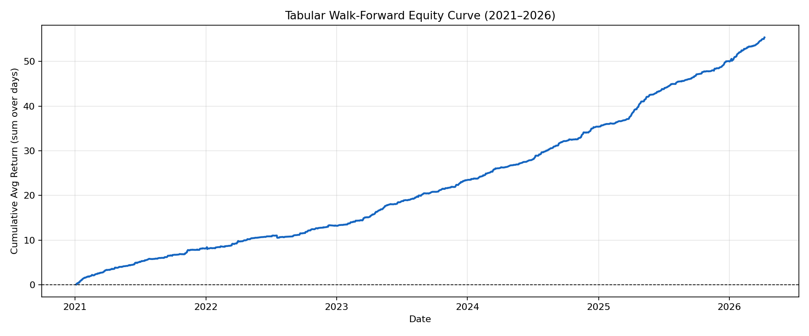
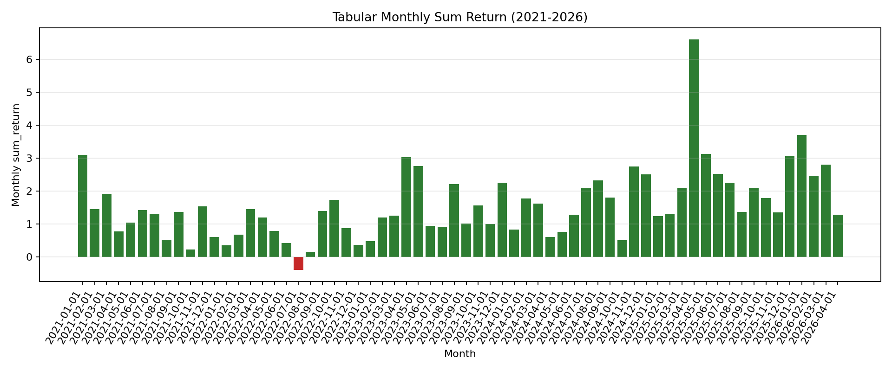

# Overnight Gap 전략 자동매매 개발자 가이드

> 이 문서만으로 동일한 알고리즘을 새 프로젝트에서 구현했을 때 **동일한 DB, 동일한 파라미터** 조건에서 같은 결과를 재현할 수 있어야 한다.

---

## 목차

1. [전략 개요](#1-전략-개요)
2. [데이터베이스 명세](#2-데이터베이스-명세)
3. [피처 엔지니어링](#3-피처-엔지니어링)
4. [후보 종목 필터](#4-후보-종목-필터)
5. [모델 구조](#5-모델-구조)
6. [학습 절차](#6-학습-절차)
7. [신호 생성 로직](#7-신호-생성-로직)
8. [Walk-Forward 백테스트 방법론](#8-walk-forward-백테스트-방법론)
9. [검증 기준 (Input → Output)](#9-검증-기준-input--output)
10. [출력 파일 명세](#10-출력-파일-명세)
11. [자동매매 실전 구현 가이드](#11-자동매매-실전-구현-가이드)
12. [환경 설정](#12-환경-설정)

---

## 1. 전략 개요

### 핵심 아이디어

**오버나이트 갭 전략**: 당일 종가에 매수 → 익일 시초가에 매도

- 전일 대비 거래량이 크게 터진 종목이 갭 상승할 확률이 높다는 가설
- ML 이진 분류기로 "익일 시초가 갭 >= min_gap" 성공 확률을 예측
- MLP 회귀 모델로 갭 크기를 추가 예측하여 필터로 사용
- 매일 장 마감 직후 신호 생성 → 당일 종가 인근 매수 → 익일 시초가 매도

### 수익 구조

```
수익 = next_open / close - 1
성공 정의: next_open / close - 1 >= min_gap (0.5%)
```

### 백테스트 기준 성과 (Walk-Forward 2021–2026)

| 연도 | 선택 종목 수 | Precision | Avg Return/day | Sum Return |
|------|-------------|-----------|----------------|------------|
| 2021 | 416 | 55.8% | 3.68% | 15.29 |
| 2022 | 357 | 53.5% | 2.53% | 9.04 |
| 2023 | 402 | 57.7% | 4.63% | 18.63 |
| 2024 | 287 | 68.6% | 6.57% | 18.85 |
| 2025 | 443 | 65.2% | 6.51% | 28.84 |
| 2026 | 130 | 73.8% | 7.89% | 10.26 |
| **전체** | **2,035** | **60.8%** | **4.96%** | **100.90** |

> `sum_return`은 각 거래일 `avg_return`의 단순 합계 (종목당 수익률의 평균을 일별로 누적).  
> 에쿼티 커브는 이 값의 누적 합산이다.

**에쿼티 커브 (2021–2026)**



**월별 수익률 막대 차트**



---

## 2. 데이터베이스 명세

### 파일 위치

```
/mnt/data/projects/kiwoom_restapi/backend/sqlite3/candle_data.db
```

### 구조

SQLite 파일. 각 테이블 = 종목 1개. 테이블명은 종목 코드 (`000660.KS`, `005930.KS` 등).

```sql
-- 모든 테이블 조회
SELECT name FROM sqlite_master WHERE type='table' AND name NOT LIKE 'sqlite_%' ORDER BY name;

-- 테이블 수: 약 2,719개 (2026-04 기준)
```

### 테이블 스키마

```sql
CREATE TABLE "000660.KS" (
    date    TEXT,    -- 'YYYY-MM-DD' 형식
    open    REAL,    -- 시가
    high    REAL,    -- 고가
    low     REAL,    -- 저가
    close   REAL,    -- 종가
    volume  INTEGER  -- 거래량
);
```

### 데이터 범위

```
데이터 시작: 2015-01-02 (대부분의 종목)
최신 데이터: 2026-04-13 기준 실시간 업데이트
총 종목 수: 2,719 (KOSPI + KOSDAQ)
```

### DB 연결 방법 (Python)

```python
import sqlite3
import polars as pl

conn = sqlite3.connect("/path/to/candle_data.db")

# 종목 목록 조회
symbols = [r[0] for r in conn.execute(
    "SELECT name FROM sqlite_master WHERE type='table' AND name NOT LIKE 'sqlite_%' ORDER BY name"
).fetchall()]

# 단일 종목 로드
df = pl.read_database(
    query='SELECT \'000660.KS\' AS symbol, date, open, high, low, close, volume FROM "000660.KS"',
    connection=conn
)
```

---

## 3. 피처 엔지니어링

### 3.1 전처리 순서

```python
# 1. 컬럼 타입 변환
df = df.with_columns([
    pl.col("date").str.strptime(pl.Date, strict=False),
    pl.col("open").cast(pl.Float64),
    pl.col("high").cast(pl.Float64),
    pl.col("low").cast(pl.Float64),
    pl.col("close").cast(pl.Float64),
    pl.col("volume").cast(pl.Float64),
])

# 2. 정렬 및 인덱스
df = df.drop_nulls(["date","open","high","low","close","volume"]) \
       .sort(["symbol", "date"]) \
       .with_row_index("row_id")
```

### 3.2 지연 컬럼 (over("symbol") = 종목별 계산)

| 컬럼명 | 수식 | 설명 |
|--------|------|------|
| `prev_close` | `close.shift(1)` | 전일 종가 |
| `prev_volume` | `volume.shift(1)` | 전일 거래량 |
| `vol_ma60` | `volume.rolling_mean(60)` | 당일 기준 60일 평균 거래량 |
| `prev_vol_ma60` | `volume.shift(1).rolling_mean(60)` | 전일 기준 60일 평균 거래량 (**핵심: 매수 시점에 알 수 있는 값**) |
| `ma5` | `close.rolling_mean(5)` | 5일 이동평균 |
| `ma50` | `close.rolling_mean(50)` | 50일 이동평균 |
| `ma100` | `close.rolling_mean(100)` | 100일 이동평균 |
| `ma200` | `close.rolling_mean(200)` | 200일 이동평균 |
| `ma400` | `close.rolling_mean(400)` | 400일 이동평균 |
| `ret_1d` | `close.pct_change()` | 1일 수익률 |
| `ret_5d` | `close.pct_change(5)` | 5일 수익률 |
| `ret_20d` | `close.pct_change(20)` | 20일 수익률 |
| `intraday_range` | `(high - low) / open` | 일중 변동폭 |
| `intraday_return` | `(close - open) / open` | 일중 수익률 |
| `next_open` | `open.shift(-1)` | 익일 시가 (레이블 생성용, 실거래에서 미사용) |

### 3.3 파생 컬럼

```python
df = df.with_columns([
    # 갭: 당일 시가 / 전일 종가 - 1
    ((pl.col("open") / pl.col("prev_close")) - 1.0).alias("gap_pct"),

    # 당일 종가 vs 전일 종가 수익률 (상한가 감지용)
    ((pl.col("close") / pl.col("prev_close")) - 1.0).alias("close_vs_prev_close_ret"),

    # 타깃: 익일 시초가 갭 (레이블 생성 및 회귀 타깃)
    ((pl.col("next_open") / pl.col("close")) - 1.0).alias("next_gap_pct"),

    # 이동평균 대비 거리 (상대적 위치)
    ((pl.col("close") / pl.col("ma5")) - 1.0).alias("dist_ma5"),
    ((pl.col("close") / pl.col("ma50")) - 1.0).alias("dist_ma50"),
    ((pl.col("close") / pl.col("ma100")) - 1.0).alias("dist_ma100"),
    ((pl.col("close") / pl.col("ma200")) - 1.0).alias("dist_ma200"),
    ((pl.col("close") / pl.col("ma400")) - 1.0).alias("dist_ma400"),
])
```

### 3.4 RSI-14

```python
delta = close.diff()
gain = delta.clip(lower_bound=0)
loss = (-delta).clip(lower_bound=0)
avg_gain = gain.rolling_mean(14)
avg_loss = loss.rolling_mean(14)

rsi14 = 100.0 - (100.0 / (1.0 + avg_gain / (avg_loss + 1e-9)))
```

Polars 구현:
```python
df = df.with_columns(pl.col("close").diff().over("symbol").alias("delta"))
df = df.with_columns([
    pl.when(pl.col("delta") > 0).then(pl.col("delta")).otherwise(0.0).alias("gain"),
    pl.when(pl.col("delta") < 0).then(-pl.col("delta")).otherwise(0.0).alias("loss"),
])
df = df.with_columns([
    pl.col("gain").rolling_mean(14).over("symbol").alias("avg_gain"),
    pl.col("loss").rolling_mean(14).over("symbol").alias("avg_loss"),
])
df = df.with_columns(
    (100.0 - (100.0 / (1.0 + pl.col("avg_gain") / (pl.col("avg_loss") + 1e-9)))).alias("rsi14")
)
df = df.drop(["delta", "gain", "loss", "avg_gain", "avg_loss"])
```

### 3.5 레이블 (이진 분류 타깃)

```python
label_success = (next_gap_pct >= min_gap).cast(Int8)
# min_gap = 0.005 (0.5%) 권장 설정
```

### 3.6 최종 피처 컬럼 목록 (21개)

```python
FEATURE_COLUMNS = [
    "volume",          # 당일 거래량
    "prev_volume",     # 전일 거래량
    "vol_ma60",        # 60일 평균 거래량 (당일 기준)
    "prev_vol_ma60",   # 60일 평균 거래량 (전일 기준)
    "ma5",             # 5일 이평
    "ma50",            # 50일 이평
    "ma100",           # 100일 이평
    "ma200",           # 200일 이평
    "ma400",           # 400일 이평
    "dist_ma5",        # close/ma5 - 1
    "dist_ma50",       # close/ma50 - 1
    "dist_ma100",      # close/ma100 - 1
    "dist_ma200",      # close/ma200 - 1
    "dist_ma400",      # close/ma400 - 1
    "rsi14",           # RSI(14)
    "ret_1d",          # 1일 수익률
    "ret_5d",          # 5일 수익률
    "ret_20d",         # 20일 수익률
    "intraday_range",  # (high - low) / open
    "intraday_return", # (close - open) / open
    "market_cap",      # 시가총액 (없으면 null → 0으로 대체)
]
# market_cap 컬럼이 없으면 21개 → 20개
```

### 3.7 전처리 (학습 전)

```python
from sklearn.preprocessing import StandardScaler
import numpy as np

def impute_scale(train_x, eval_x):
    # NaN, +inf, -inf → 0으로 대체
    train_x = np.nan_to_num(train_x, nan=0.0, posinf=0.0, neginf=0.0)
    eval_x  = np.nan_to_num(eval_x,  nan=0.0, posinf=0.0, neginf=0.0)

    scaler = StandardScaler()
    train_x = scaler.fit_transform(train_x)  # train 기준으로 fit
    eval_x  = scaler.transform(eval_x)       # 동일 scaler로 transform (leakage 방지)
    return train_x, eval_x, scaler
```

> ⚠️ **중요**: `scaler.fit()`은 반드시 **train set에만** 수행. eval/test set은 `transform()`만 사용.

---

## 4. 후보 종목 필터

신호 대상 종목을 필터링하는 조건. **세 조건 모두** 충족해야 후보 선정.

### 조건 1: 갭 상승 조건

```python
gap_pct = open_t / close_(t-1) - 1 >= min_gap
# 기본값: min_gap = 0.005 (0.5%)
```

> 당일 시가가 전일 종가 대비 최소 0.5% 이상 갭 상승.

### 조건 2: 전일 거래량 조건 (**핵심 교정**)

```python
volume_(t-1) >= prev_vol_ma60 * vol_multiplier
# vol_multiplier = 3.0 권장
# prev_vol_ma60 = 전일(t-1) 기준의 60일 평균 거래량
```

> ⚠️ **`vol_ma60`이 아닌 `prev_vol_ma60`을 사용해야 함.**  
> 매수 시점(t일 장 마감)에는 t일의 vol_ma60이 이미 t일 거래량을 포함하므로, 순수 전일까지의 평균인 `prev_vol_ma60`이 leak-free 기준이다.

### 조건 3: 상한가/근접 종목 제외

```python
close_vs_prev_close_ret = close_t / close_(t-1) - 1 < limitup_exclude_rate
# limitup_exclude_rate = 0.295 (29.5%)
# 해당 값 이상이면 상한가 또는 근접 → 제외
```

> 전일 이미 상한가에 근접한 종목은 익일 추가 갭 상승 여지가 제한적.

### Python 구현

```python
is_gap_volume_candidate = (
    (pl.col("gap_pct") >= min_gap)
    & (pl.col("prev_volume") >= pl.col("prev_vol_ma60") * vol_multiplier)
    & (pl.col("close_vs_prev_close_ret") < limitup_exclude_rate)
)
```

---

## 5. 모델 구조

### 5.1 MLP 회귀 모델 (갭 크기 예측)

```python
class MLPRegressor(nn.Module):
    def __init__(self, in_dim: int, hidden_dim: int = 128):
        super().__init__()
        self.net = nn.Sequential(
            nn.Linear(in_dim, hidden_dim),
            nn.ReLU(),
            nn.Dropout(0.2),
            nn.Linear(hidden_dim, hidden_dim // 2),
            nn.ReLU(),
            nn.Dropout(0.1),
            nn.Linear(hidden_dim // 2, 1),
        )

    def forward(self, x):
        return self.net(x).squeeze(-1)
```

- **입력**: `(batch, 20)` float32
- **출력**: `(batch,)` — 예측 `next_gap_pct`
- **손실함수**: `HuberLoss` (이상치에 강건)

### 5.2 MLP 분류 모델 (성공 확률 예측)

```python
class MLPClassifier(nn.Module):
    def __init__(self, in_dim: int, hidden_dim: int = 128):
        super().__init__()
        self.net = nn.Sequential(
            nn.Linear(in_dim, hidden_dim),
            nn.ReLU(),
            nn.Dropout(0.2),
            nn.Linear(hidden_dim, hidden_dim // 2),
            nn.ReLU(),
            nn.Dropout(0.1),
            nn.Linear(hidden_dim // 2, 1),
        )

    def forward(self, x):
        return self.net(x).squeeze(-1)  # logit 반환 (sigmoid 미적용)
```

- **입력**: `(batch, 20)` float32
- **출력**: `(batch,)` logit → sigmoid 적용하면 확률 `prob_tab`
- **손실함수**: `BCEWithLogitsLoss(pos_weight=neg_count/pos_count)` (클래스 불균형 보정)

### 5.3 Candle CNN 모델 (이미지 기반 분류)

```python
class CandleCNN(nn.Module):
    def __init__(self, image_size: int):
        super().__init__()
        self.conv = nn.Sequential(
            nn.Conv2d(1, 16, 3, padding=1), nn.ReLU(), nn.MaxPool2d(2),
            nn.Conv2d(16, 32, 3, padding=1), nn.ReLU(), nn.MaxPool2d(2),
            nn.Conv2d(32, 64, 3, padding=1), nn.ReLU(), nn.AdaptiveAvgPool2d((4, 4)),
        )
        self.head = nn.Sequential(
            nn.Flatten(),
            nn.Linear(64 * 4 * 4, 64), nn.ReLU(), nn.Dropout(0.1),
            nn.Linear(64, 1),
        )
```

- **입력**: `(batch, 1, 64, 64)` — 30봉 캔들 차트를 64×64 흑백 이미지로 렌더링
- **출력**: `(batch,)` logit

#### 캔들 이미지 렌더링 규칙

```python
def render_candle_image(op, hi, lo, cl, vol, size=64):
    img = np.zeros((size, size), dtype=np.float32)
    p_min, p_max = np.min(lo), np.max(hi)
    p_rng = max(p_max - p_min, 1e-9)
    w = len(op)

    for i in range(w):
        x = int((i + 0.5) * size / w)

        # 심지: pixel값 0.6
        y_high = size-1 - int((hi[i]-p_min)/p_rng * (size-1) * 0.75)
        y_low  = size-1 - int((lo[i]-p_min)/p_rng * (size-1) * 0.75)
        img[min(y_high,y_low):max(y_high,y_low)+1, x] = 0.6

        # 몸통: 양봉=1.0, 음봉=0.35 (폭 ±1픽셀)
        y_o = size-1 - int((op[i]-p_min)/p_rng * (size-1) * 0.75)
        y_c = size-1 - int((cl[i]-p_min)/p_rng * (size-1) * 0.75)
        body_val = 1.0 if cl[i] >= op[i] else 0.35
        img[min(y_o,y_c):max(y_o,y_c)+1, max(0,x-1):min(size-1,x+1)+1] = body_val

    # 거래량 막대 (하단 20% 영역): pixel값 0.5
    v = vol / max(vol.max(), 1e-9)
    base_top = int(size * 0.8)
    for i in range(w):
        x = int((i + 0.5) * size / w)
        h = int(v[i] * (size - base_top - 1))
        if h > 0:
            img[size-h:size, x] = 0.5

    return img  # shape: (64, 64)
```

---

## 6. 학습 절차

### 6.1 공통 하이퍼파라미터

```python
batch_size   = 512
epochs       = 20
lr           = 1e-3
weight_decay = 1e-5
hidden_dim   = 128
image_window = 30   # 캔들 이미지 윈도우 (30봉)
image_size   = 64   # 이미지 크기 (64×64)
```

### 6.2 학습 데이터 분리

```
fit_df   = 후보 종목 중 optimize_start 이전 데이터 (모델 학습용)
opt_df   = optimize_start ~ optimize_end 구간 (threshold/max_pos 파라미터 탐색용)
test_df  = test_start ~ test_end 구간 (최종 검증용)
```

### 6.3 학습 흐름

```
1. fit_df → StandardScaler fit → train_x 변환
2. opt_df, test_df → 동일 scaler.transform() 적용
3. MLPRegressor 학습 (HuberLoss, AdamW)
   - 입력: train_x, 타깃: next_gap_pct (float)
   - opt_df / test_df → pred_next_gap_pct 생성
4. MLPClassifier 학습 (BCEWithLogitsLoss, pos_weight, AdamW)
   - 입력: train_x, 타깃: label_success (0/1)
   - opt_df / test_df → prob_tab (0~1) 생성
5. CandleCNN 학습 (BCEWithLogitsLoss, 동일 설정)
   - 캔들 이미지 텐서 입력
   - opt_df / test_df → prob_img (0~1) 생성
6. Fusion: prob_fusion = 0.5 * prob_tab + 0.5 * prob_img
```

### 6.4 Classifier 학습 함수 핵심

```python
def train_classifier(model, train_x, train_y, eval_x, cfg, device):
    pos = train_y.sum()
    neg = len(train_y) - pos
    pos_weight = torch.tensor([neg / max(pos, 1.0)], device=device)
    crit = nn.BCEWithLogitsLoss(pos_weight=pos_weight)
    opt  = torch.optim.AdamW(model.parameters(), lr=cfg.lr, weight_decay=cfg.weight_decay)

    ds = TensorDataset(torch.tensor(train_x, dtype=torch.float32),
                       torch.tensor(train_y, dtype=torch.float32))
    dl = DataLoader(ds, batch_size=cfg.batch_size, shuffle=True)

    model.train()
    for epoch in range(cfg.epochs):
        for xb, yb in dl:
            opt.zero_grad()
            loss = crit(model(xb.to(device)), yb.to(device))
            loss.backward()
            opt.step()

    model.eval()
    with torch.no_grad():
        logits = model(torch.tensor(eval_x, dtype=torch.float32, device=device)).cpu().numpy()
    return 1.0 / (1.0 + np.exp(-logits))  # sigmoid
```

---

## 7. 신호 생성 로직

### 7.1 신호 조건 (AND 조건)

```python
signal = (prob_tab >= threshold) AND (pred_next_gap_pct >= min_gap)
```

| 변수 | 기본값 | 설명 |
|------|--------|------|
| `threshold` | 0.50 | MLP 분류기 확률 하한 |
| `min_gap` | 0.005 | 회귀 예측 갭 하한 (0.5%) |

### 7.2 일별 포지션 제한 (랭킹 필터)

```python
# 신호 발생 종목을 prob_tab 내림차순 정렬 후 상위 max_positions만 선택
signals = scored.filter(signal == 1).sort(["date", "prob_tab"], descending=[False, True])
picked  = signals.group_by("date").head(max_positions)  # top-N/day
# max_positions = 2 (백테스트 최적 설정)
```

### 7.3 실전 매매 시점

```
T일 장 마감 (15:30) 후
├── DB에서 당일 OHLCV 업데이트 확인
├── is_gap_volume_candidate 필터 적용
├── 피처 생성 → StandardScaler 변환
├── MLP 분류기 forward → prob_tab 계산
├── MLP 회귀기 forward → pred_next_gap_pct 계산
├── signal = (prob_tab >= 0.5) AND (pred_gap >= 0.005)
├── 상위 max_positions 종목 선택 (prob_tab 내림차순)
└── T+1일 시초가 매수 주문 (동시호가 or 시장가 매수)

T+1일 시초가 (09:00) 직후
└── 체결된 매수 포지션 시초가 즉시 매도
```

---

## 8. Walk-Forward 백테스트 방법론

### 8.1 Expanding Window 방식

```
eval_year = 2021: train ← year < 2021 불가 → 2021부터 시작 (train은 상대적으로 작음)
eval_year = 2022: train ← year < 2022, eval ← year == 2022
eval_year = 2023: train ← year < 2023, eval ← year == 2023
...
eval_year = 2026: train ← year < 2026, eval ← year == 2026
```

> **Data leakage 없음**: eval_year 데이터는 train에 포함되지 않음.

### 8.2 구현

```python
for eval_year in range(start_year, end_year + 1):
    train_df = candidates.filter(pl.col("year") < eval_year)
    eval_df  = candidates.filter(pl.col("year") == eval_year)
    if train_df.height == 0 or eval_df.height == 0:
        continue

    # StandardScaler: train으로 fit, eval에 transform
    train_x, eval_x, _ = impute_scale(train_df[features], eval_df[features])

    # 회귀 + 분류 모델 학습
    pred_gap = train_regressor(train_x, train_df["next_gap_pct"], eval_x, cfg, device)
    prob_tab = train_classifier(MLPClassifier(in_dim), train_x, train_df["label_success"], eval_x, cfg, device)

    # 신호 생성 및 성과 측정
    picked, daily, metrics = select_positions(eval_df, prob_tab, pred_gap, threshold=0.50, max_positions=2, min_gap=0.005)
```

### 8.3 성과 집계

```python
# 일별 성과
daily = picked.group_by("date").agg([
    pl.len().alias("trades"),
    pl.col("overnight_return").mean().alias("avg_return"),   # 해당일 선택 종목 평균 수익률
    pl.col("overnight_return").sum().alias("sum_return"),
    pl.col("label_success").mean().alias("precision_day"),
])

# 전체 지표
precision  = selected["label_success"].mean()   # 성공률
avg_return = selected["overnight_return"].mean() # 평균 수익률/거래
sum_return = daily["avg_return"].sum()           # 일별 avg_return 누적 합산
```

---

## 9. 검증 기준 (Input → Output)

동일 DB + 동일 파라미터로 구현 시 재현 가능한 검증 수치.

### 9.1 실행 커맨드

```bash
python scripts/tabular_walkforward_backtest.py \
  --db-path /mnt/data/projects/kiwoom_restapi/backend/sqlite3/candle_data.db \
  --start-year 2021 \
  --end-year 2026 \
  --min-gap 0.005 \
  --vol-multiplier 3.0 \
  --limitup-exclude-rate 1.0 \
  --threshold 0.50 \
  --max-positions 2
```

> `--limitup-exclude-rate 1.0`은 상한가 필터 비활성화 (100% = 모두 허용).

### 9.2 전처리 후 예상 데이터 규모

| 항목 | 값 |
|------|-----|
| 전체 종목 수 | 2,719 |
| 전체 OHLCV 행 수 (2015~2026) | ~23,000,000 |
| 2021~2026 후보(is_gap_volume_candidate=true) | ~117,600 |
| 연간 후보 (평균) | ~19,600 |

### 9.3 연도별 예상 결과 (검증 기준값)

| eval_year | train_rows | selected | precision | avg_return | sum_return |
|-----------|-----------|---------|-----------|------------|------------|
| 2021 | 51,889 | 416 | 0.5577 | 0.0368 | 15.29 |
| 2022 | 61,635 | 357 | 0.5350 | 0.0253 | 9.04 |
| 2023 | 70,449 | 402 | 0.5771 | 0.0463 | 18.63 |
| 2024 | 80,148 | 287 | 0.6864 | 0.0657 | 18.85 |
| 2025 | 89,212 | 443 | 0.6524 | 0.0651 | 28.84 |
| 2026 | 99,290 | 130 | 0.7385 | 0.0789 | 10.26 |

> ⚠️ MLP는 초기화 랜덤성(random seed)으로 인해 실행마다 소폭 차이 발생 가능.  
> 동일 결과 재현을 위해 `torch.manual_seed(42)` 및 `np.random.seed(42)` 설정 권장.

### 9.4 전체 성과 기준값

```
전체 선택 수: 2,035
전체 precision: 60.8%
전체 avg_return: 4.96%
전체 sum_return: 100.90
```

### 9.5 중간 검증 포인트

새 구현체에서 단계별로 아래 값을 확인하여 파이프라인 정합성을 검증한다.

```python
# 1. 후보 필터 검증 (2021~2026 전체)
assert 115_000 < candidates.height < 120_000, "후보 수 범위 이탈"

# 2. 피처 컬럼 수 검증 (market_cap 없는 경우)
assert len(feature_columns(candidates)) == 20

# 3. 연도별 후보 수 검증 (2024 기준)
count_2024 = candidates.filter(pl.col("year") == 2024).height
assert 8_000 < count_2024 < 15_000, f"2024 후보 수 이상: {count_2024}"

# 4. label 비율 검증 (성공/실패 비율 50:50 근방이어야 정상)
label_rate = candidates["label_success"].mean()
assert 0.40 < label_rate < 0.60, f"레이블 불균형 이상: {label_rate}"
```

---

## 10. 출력 파일 명세

### 10.1 walk-forward 스크립트 출력

```
docs/outputs/tabular_walkforward/
├── yearly_summary_2021_2026.csv        # 연도별 성과 요약
├── daily_returns_2021_2026.csv         # 일별 수익률 (date, trades, avg_return, sum_return, precision_day)
├── monthly_returns_2021_2026.csv       # 월별 집계 (period, trades, avg_return, sum_return)
├── weekly_returns_2021_2026.csv        # 주별 집계
├── selected_positions_2021_2026.csv    # 선택된 전체 포지션 (종목, 날짜, 예측값, 실제 수익률)
├── tabular_equity_curve_2021_2026.png  # 누적 수익률 선 그래프
└── tabular_monthly_returns_2021_2026.png  # 월별 수익률 막대 그래프
```

### 10.2 selected_positions CSV 스키마

```
symbol, date, open, high, low, close, volume,
prev_close, prev_volume, vol_ma60, prev_vol_ma60,
gap_pct, next_gap_pct, label_success, rsi14,
dist_ma5, dist_ma50, ... , ret_1d, ret_5d, ret_20d,
pred_next_gap_pct, prob_tab, overnight_return,
signal, year
```

---

## 11. 자동매매 실전 구현 가이드

### 11.1 프로젝트 구조 (권장)

```
autotrading-overnight/
├── config.py                  # 파라미터 설정 (Config dataclass)
├── data/
│   └── loader.py              # DB 로드 + 피처 생성
├── models/
│   ├── classifier.py          # MLPClassifier 구조
│   ├── regressor.py           # MLPRegressor 구조
│   ├── train.py               # 학습 함수
│   └── saved/                 # 학습된 모델 파일 (.pt 또는 .onnx)
├── strategy/
│   ├── candidate_filter.py    # 후보 종목 필터
│   ├── signal_generator.py    # 신호 생성 (장 마감 후 실행)
│   └── position_manager.py    # 포지션 관리 (일별 top-N)
├── broker/
│   └── kiwoom.py              # 키움 API 연동 (주문 실행)
├── scheduler.py               # 일별 스케줄러 (apscheduler)
├── backtest/
│   └── walk_forward.py        # 백테스트 복사 (검증용)
└── requirements.txt
```

### 11.2 일별 운영 사이클

```python
# scheduler.py — 매 거래일 자동 실행 흐름

# 15:30 이후 (장 마감)
async def daily_signal_job():
    # 1. DB에서 당일 최신 데이터 확인
    conn = sqlite3.connect(DB_PATH)
    raw = load_ohlcv(conn, list_symbol_tables(conn))

    # 2. 당일 기준으로 피처 생성
    data = build_features(raw, cfg, metadata=None)
    today = data.filter(pl.col("date") == datetime.today().date())
    candidates_today = today.filter(pl.col("is_gap_volume_candidate"))

    if candidates_today.height == 0:
        logger.info("오늘 후보 없음")
        return

    # 3. 저장된 모델 로드 (또는 최근 N개월 데이터로 재학습)
    model_tab = load_model("models/saved/tabular_classifier.pt")
    model_reg = load_model("models/saved/tabular_regressor.pt")

    # 4. 스케일링 (train scaler 재사용)
    x_today = impute_scale_apply(candidates_today[FEATURE_COLUMNS], scaler)

    # 5. 예측
    prob_tab      = sigmoid(model_tab(x_today))
    pred_gap      = model_reg(x_today)

    # 6. 신호 생성
    candidates_today = candidates_today.with_columns([
        pl.Series("prob_tab", prob_tab),
        pl.Series("pred_next_gap_pct", pred_gap),
    ])
    signals = candidates_today.filter(
        (pl.col("prob_tab") >= THRESHOLD) & (pl.col("pred_next_gap_pct") >= MIN_GAP)
    ).sort("prob_tab", descending=True).head(MAX_POSITIONS)

    # 7. 주문 실행
    for row in signals.iter_rows(named=True):
        broker.place_order(
            symbol=row["symbol"],
            order_type="BUY_MARKET",
            quantity=calc_quantity(row["symbol"], budget_per_trade),
        )
    logger.info(f"신호 종목: {signals['symbol'].to_list()}")

# 09:00 ~ 09:05 (익일 시초가 체결 직후)
async def morning_exit_job():
    for position in portfolio.open_positions():
        broker.place_order(
            symbol=position.symbol,
            order_type="SELL_MARKET",
            quantity=position.quantity,
        )
```

### 11.3 모델 재학습 주기

```
권장: 매월 1회 전체 재학습
- 학습 데이터: DB 전체 기간 (2015 ~ 재학습 시점 -1개월)
- 검증: 최근 1개월 fix_rule 시뮬레이션으로 확인
- 재학습 트리거: 일별 precision이 2주 연속 50% 미만

Scaler 저장 필수:
  - joblib.dump(scaler, "models/saved/standard_scaler.pkl")
  - 신호 생성 시 동일 scaler 로드하여 transform
```

### 11.4 위험 관리

| 항목 | 설정값 | 설명 |
|------|--------|------|
| 종목당 최대 투자 | 총 자산의 5~10% | 집중 위험 방지 |
| 일별 최대 종목 수 | 2종목 (max_positions) | 백테스트 최적값 |
| 손절 없음 | — | 시초가 즉시 매도로 보유 기간 = 0 |
| 시장 전체 하락 필터 | 코스피 -2% 이하 시 신호 무시 | 선택적 적용 |

### 11.5 키움 API 연동 시 주의사항

```python
# 주문 유형 코드 (키움 KOA)
# "00" = 지정가
# "03" = 시장가
# "05" = 조건부 지정가 (시초가 장 시작 직후 시장가 전환)

# 오버나이트 전략 최적 주문 방식:
# 매수: T일 15:20~15:29 장 마감 동시호가 (시장가 또는 현재가 +1호가)
# 매도: T+1일 09:00 시초가 동시호가 매도 (시장가)
# → 시초가 갭을 온전히 포착
```

---

## 12. 환경 설정

### 12.1 Python 의존성

```txt
# requirements-overnight.txt
polars>=0.20
numpy>=1.26
torch>=2.1
torchvision>=0.16
scikit-learn>=1.4
matplotlib>=3.9
onnx>=1.15
onnxruntime>=1.17
```

### 12.2 설치

```bash
python3 -m venv .venv
source .venv/bin/activate
pip install -r requirements-overnight.txt
```

### 12.3 GPU 환경 (권장)

```bash
# CUDA 12.x 기준
pip install torch torchvision --index-url https://download.pytorch.org/whl/cu121
```

### 12.4 검증 실행

```bash
# walk-forward 백테스트 전체 실행 (~10분 소요, GPU 기준)
python scripts/tabular_walkforward_backtest.py \
  --db-path /mnt/data/projects/kiwoom_restapi/backend/sqlite3/candle_data.db \
  --start-year 2021 \
  --end-year 2026 \
  --min-gap 0.005 \
  --vol-multiplier 3.0 \
  --limitup-exclude-rate 1.0 \
  --threshold 0.50 \
  --max-positions 2 \
  --report-path docs/tabular_walkforward_verify.md

# 기대 결과:
# 전체 sum_return ≈ 100 (±5 허용)
# 전체 precision > 58%
# 2024 sum_return > 15
# 2025 sum_return > 25
```

---

## 부록: 핵심 설계 결정 사항

| 결정 | 선택 | 이유 |
|------|------|------|
| 거래량 기준 | `prev_vol_ma60` (전일 기준) | `vol_ma60` 사용 시 당일 거래량 포함 → data leakage |
| 레이블 기준 | `next_gap_pct >= 0.5%` | 1% 기준 시 2024/2025 신호 0건 (모델 underprediction) |
| 에쿼티 계산 | `cumsum(avg_return)` | `cumprod(1+avg_return)` 사용 시 지수 폭발 (avg는 합계 개념) |
| 모델 재사용 | 매 eval_year마다 새로 학습 | 미래 데이터 미사용, expanding window 유지 |
| Scaler fit | train set에만 | eval/test leakage 방지 |
| 상한가 필터 | 비활성화 권장 (1.0) | 필터 on 시 성과 대폭 하락 (A/B 검증 완료) |
